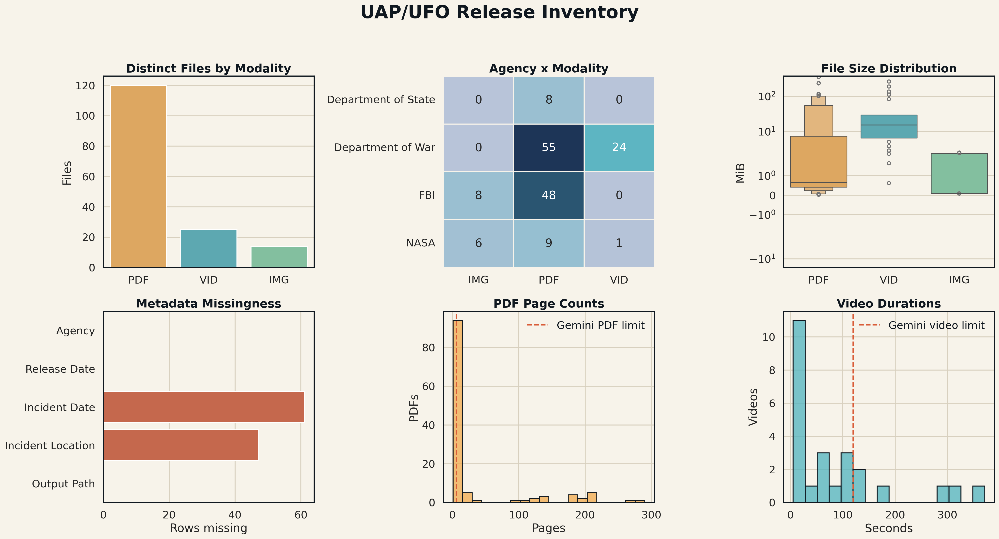
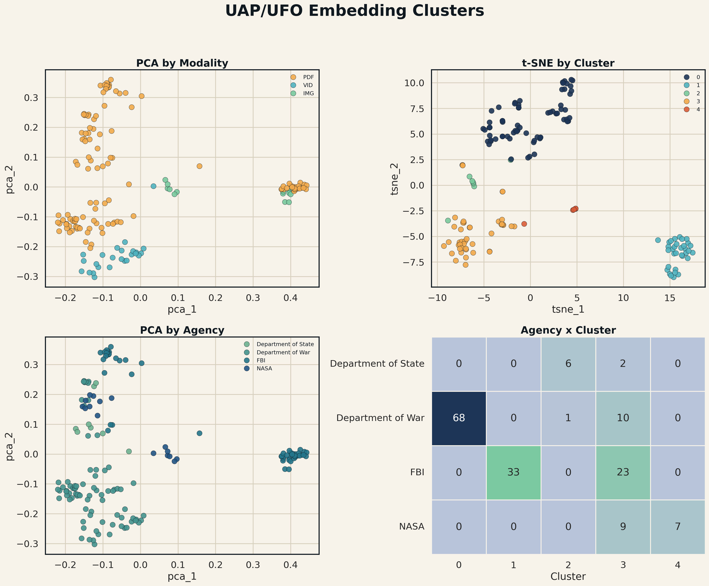
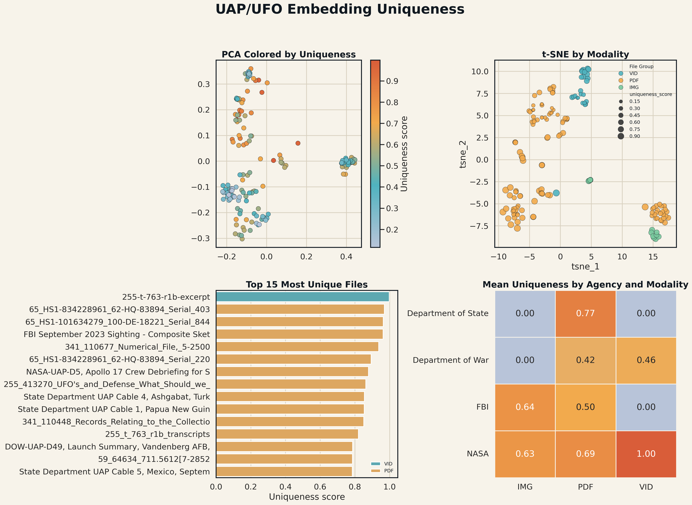

# UAP May 8 Release: Embedding Analysis Report

## 1. Purpose of This Work

The goal of this analysis was to turn the downloaded UAP/UFO release files into a structured, searchable, and analyzable research dataset.

The original source material is mixed: PDFs, images, and videos. That makes it difficult to compare files by hand because some records are official reports, some are historical archive documents, some are videos, and some are image-based materials.

The practical research question was:

> Can we represent every released UAP file in a shared embedding space, then use that space to see which records group together and which records are most unusual?

This is not an attempt to prove or disprove any UAP claim. The work is a data-organization and evidence-mapping step. It asks what the released files look like when compared by content, metadata, and modality using multimodal embeddings.

## 2. What Was Actually Run

Two sample notebooks were used as the conceptual template:

- `sample-code/Anomaly_detection_with_embeddings.ipynb`
- `sample-code/clustering_with_embeddings.ipynb`

Those notebooks show the basic workflow:

- convert records into embeddings
- visualize embeddings with dimensionality reduction
- cluster similar records
- identify records that are far from the center of their group

For this project, that notebook logic was rewritten into reusable scripts that operate on the actual UAP release files.

The actual analysis was run through these scripts:

- `scripts/ufo_inventory.py`
- `scripts/ufo_embed_multimodal.py`
- `scripts/ufo_cluster_embeddings.py`
- `scripts/ufo_anomaly_embeddings.py`

The sample notebooks themselves were not the final execution environment. Their logic was adapted into scripts that can be rerun and audited.

## 3. Dataset Inventory

The release metadata contains 162 rows.

After deduplicating rows that point to the same physical file, the dataset contains 159 distinct files.

The final file inventory is:

| Type | Count |
|---|---:|
| PDF files | 120 |
| Video files | 25 |
| Image files | 14 |
| Total distinct files | 159 |

The difference between 162 metadata rows and 159 physical files is not a missing-data problem. Some metadata rows point to duplicate video files:

- `DOW-UAP-D32__Mission_Report__Syria__October_2024.mp4`
- `DOW-UAP-D23__Mission_Report__United_Arab_Emirates__October_2023.mp4`

Agency distribution by distinct physical file:

| Agency | Distinct Files |
|---|---:|
| Department of War | 79 |
| FBI | 56 |
| NASA | 16 |
| Department of State | 8 |

Approximate total dataset size:

| Type | Size |
|---|---:|
| PDFs | 2362.985 MiB |
| Videos | 1122.011 MiB |
| Images | 14.529 MiB |
| Total | 3499.525 MiB |

The PDFs contain 4,185 total pages. The largest PDF has 290 pages.

The videos have about 2,180.96 seconds of total runtime. The longest video is about 371.6 seconds.

## 4. Inventory Figure



This figure summarizes the shape of the dataset before any machine-learning analysis.

It shows:

- how many files exist in each modality
- how the files are distributed by agency
- how file sizes vary across PDFs, images, and videos
- which metadata fields are missing most often
- how long the PDFs are
- how long the videos are

The most important takeaway is that this is not a simple text dataset. It is a mixed multimodal archive. Any analysis that only reads plain text would miss visual and video content.

## 5. Embedding Strategy

The embedding model used was `gemini-embedding-2`.

The reason for using this model is that it supports multimodal input. PDFs, images, videos, and text metadata can all be embedded into the same vector space.

Each file was represented using:

- the file's metadata text
- the actual media content when possible
- chunk-level representations for long files
- one final averaged file-level embedding

This means each final embedding is not just a filename or metadata row. It is a content-aware representation of the released file.

## 6. How PDFs Were Handled

Gemini document embedding supports a maximum of 6 PDF pages per request.

Because many PDFs are longer than 6 pages, the PDFs were processed in chunks.

The strategy was:

1. Split each long PDF into 6-page ranges.
2. Embed each chunk separately.
3. Average the chunk embeddings into one final document-level embedding.

Some PDFs were encrypted in a way that prevented direct PDF merging. For those files, the pages were rasterized into page images and embedded as image groups. This preserved the 6-page-per-request structure while avoiding a failed PDF-processing path.

This is why the analysis has more chunk embeddings than final document embeddings.

## 7. How Images and Videos Were Handled

Images were embedded directly with their metadata.

Videos were handled in two ways:

- videos up to 120 seconds were embedded directly
- videos longer than 120 seconds were represented using sampled frames

This is because Gemini video embedding supports videos up to 120 seconds. For longer videos, representative frames were extracted and embedded as images.

## 8. Embedding Output

The analysis produced two levels of embeddings.

Chunk-level embeddings:

| Output | Value |
|---|---:|
| Number of chunk embeddings | 801 |
| Vector dimension | 3072 |

Document-level embeddings:

| Output | Value |
|---|---:|
| Number of final file embeddings | 159 |
| Vector dimension | 3072 |

The chunk-level embeddings are useful for inspecting parts of long PDFs.

The document-level embeddings are the main dataset for clustering, anomaly detection, search, and future research.

## 9. Where Embeddings Are Stored

The final embedding files are stored in:

```text
analysis/embeddings/
```

Important files:

```text
analysis/embeddings/document_embeddings.npz
analysis/embeddings/document_index.csv
analysis/embeddings/chunk_embeddings.npz
analysis/embeddings/chunk_index.csv
analysis/embeddings/embedding_plan.csv
```

`document_embeddings.npz` contains the 159 final file-level embedding vectors.

`document_index.csv` tells you which embedding belongs to which file.

`chunk_embeddings.npz` contains the 801 lower-level chunk embeddings.

`chunk_index.csv` tells you which chunk belongs to which file and which pages or media section it represents.

The model returned 3072-dimensional vectors.

The embedding matrices are stored as compressed NumPy `.npz` files because that is compact and easy to load in Python.

## 10. Clustering Analysis

The clustering step asked:

> Which files naturally group together in the embedding space?

The script tested cluster counts from 2 to 12 and selected 5 clusters based on silhouette score.

Final clustering result:

| Item | Value |
|---|---:|
| Documents clustered | 159 |
| Selected clusters | 5 |
| PCA component 1 explained variance | 0.2375 |
| PCA component 2 explained variance | 0.1685 |

The cluster output is stored in:

```text
analysis/clustering/document_clusters.csv
analysis/clustering/cluster_summary.csv
analysis/clustering/cluster_model_summary.json
```

## 11. Clustering Figure



This figure shows the embedding space in two reduced forms:

- PCA, which gives a more linear summary of major variation
- t-SNE, which helps show local neighborhoods and visual groupings

The figure also compares clusters against agency and file type.

The main human-level interpretation is:

- Department of War PDFs and videos form a large region of the space.
- FBI files form their own strong groups.
- NASA visual materials are distinct from many of the historical PDF-heavy records.
- State Department documents are few but appear as a separate small group in the cluster summary.

This does not mean one cluster is more important than another. It means the model sees those records as similar in content, format, or visual/textual structure.

## 12. Anomaly and Uniqueness Analysis

The anomaly analysis asked:

> Which files are most unusual compared with the rest of the release?

The word "anomaly" here means unusual in embedding space. It does not mean "proof of alien activity" or "scientifically unexplained." It means the file looks different from other files according to the embedding model.

The uniqueness score combined several signals:

- distance from the global center of the dataset
- distance from the center of the same file type
- distance from the center of the same agency
- distance from nearest neighbors
- cosine distance from the dataset center
- Isolation Forest uniqueness score

The full output is stored in:

```text
analysis/anomaly/ufo_anomaly_scores.csv
analysis/anomaly/top_unique.csv
analysis/anomaly/anomaly_summary.json
```

## 13. Anomaly Figure



This figure shows:

- where high-uniqueness files sit in PCA space
- how file type relates to uniqueness in t-SNE space
- the top 15 most unique files
- average uniqueness by agency and modality

The most unique file in this run was:

| Rank | Title | Agency | Type | Score |
|---:|---|---|---|---:|
| 1 | `255-t-763-r1b-excerpt` | NASA | VID | 0.9979 |

Top 15 unique files:

| Rank | Title | Agency | Type | Score |
|---:|---|---|---|---:|
| 1 | `255-t-763-r1b-excerpt` | NASA | VID | 0.9979 |
| 2 | `65_HS1-834228961_62-HQ-83894_Serial_403` | FBI | PDF | 0.9696 |
| 3 | `65_HS1-101634279_100-DE-18221_Serial_844` | FBI | PDF | 0.9633 |
| 4 | `FBI September 2023 Sighting - Composite Sketch` | FBI | PDF | 0.9623 |
| 5 | `341_110677_Numerical_File,_5-2500` | Department of War | PDF | 0.9371 |
| 6 | `65_HS1-834228961_62-HQ-83894_Serial_220` | FBI | PDF | 0.8931 |
| 7 | `NASA-UAP-D5, Apollo 17 Crew Debriefing for Science, 1973` | NASA | PDF | 0.8784 |
| 8 | `255_413270_UFO's_and_Defense_What_Should_we_Prepare_For` | NASA | PDF | 0.8627 |
| 9 | `State Department UAP Cable 4, Ashgabat, Turkmenistan, November 5, 2004` | Department of State | PDF | 0.8548 |
| 10 | `State Department UAP Cable 1, Papua New Guinea, January 28, 1985` | Department of State | PDF | 0.8532 |
| 11 | `341_110448_Records_Relating_to_the_Collection_and_Dissemination_of_Intelligence_1948-1955-TS_CONT_No.2_2-5300-2-5399` | Department of War | PDF | 0.8512 |
| 12 | `255_t_763_r1b_transcripts` | NASA | PDF | 0.8202 |
| 13 | `DOW-UAP-D49, Launch Summary, Vandenberg AFB, 2000` | Department of War | PDF | 0.7867 |
| 14 | `59_64634_711.5612[7-2852` | Department of State | PDF | 0.7856 |
| 15 | `State Department UAP Cable 5, Mexico, September 16, 2003` | Department of State | PDF | 0.7851 |

These files should be treated as priority candidates for manual review, not as automatic conclusions.

## 14. What the Results Mean

The analysis succeeded in building a usable multimodal embedding dataset for the release.

The main outcomes are:

- all 159 distinct physical files now have document-level embeddings
- long PDFs were handled through chunking
- videos and images were included rather than ignored
- clustering found 5 broad groups
- anomaly scoring produced a ranked list of unusually represented records
- all outputs are saved locally and can be reused without spending API calls again

The most important research value is that the release is now easier to search, compare, visualize, and prioritize for review.

## 15. What the Results Do Not Mean

The embeddings do not determine truth.

The model does not know whether an event is real, misidentified, explained, unexplained, or significant.

An unusually placed file may be unusual because of:

- visual format
- document age
- agency source
- page layout
- unusual vocabulary
- image/video content
- poor scan quality
- genuinely different subject matter

Therefore, the anomaly list should be used as a triage tool.

It tells us where to look first, not what to believe.

## 16. If You Want a Separate Hugging Face Dataset for Embeddings

Yes, the embeddings can be uploaded as a separate Hugging Face dataset.

That is actually the better approach.

The raw media dataset and the embedding dataset should be separate:

- raw release dataset: PDFs, videos, images, metadata
- embeddings dataset: vectors, indexes, derived analysis tables, figures

This keeps the original archive clean and makes the embedding dataset smaller and easier to version.

Recommended local staging folder:

```text
hf-uap-may8-embeddings/
  README.md
  document_embeddings.npz
  document_index.csv
  chunk_embeddings.npz
  chunk_index.csv
  embedding_plan.csv
  inventory_summary.json
  inventory_documents.csv
  clustering/
    document_clusters.csv
    cluster_summary.csv
    cluster_model_summary.json
  anomaly/
    ufo_anomaly_scores.csv
    top_unique.csv
    anomaly_summary.json
  figures/
    ufo_inventory_overview.png
    ufo_clustering_overview.png
    ufo_anomaly_overview.png
```

Optional extra files:

```text
document_embeddings.parquet
chunk_embeddings.parquet
```

The `.npz` files are best for Python workflows.

Parquet is useful if you want easy dataset preview or column-based loading on Hugging Face.

Suggested Hugging Face repo names:

```text
HawkFranklin-Research/UAP-May8-Embeddings
HawkFranklin-Research/UAP-May8-Gemini-Embeddings
HawkFranklin-Research/UAP-May8-Multimodal-Embeddings
```

Recommended dataset card language:

> This dataset contains derived multimodal embeddings for the May 8 UAP/UFO release. The original source files are available separately in the raw UAP-May8 dataset. Embeddings were generated from file metadata and media content using Gemini multimodal embeddings. Long PDFs were chunked and averaged into document-level representations.

## 17. How to Load the Embeddings Later

Example Python loading pattern:

```python
import numpy as np
import pandas as pd

emb = np.load("document_embeddings.npz")
vectors = emb["embeddings"]
ids = emb["ids"]

index = pd.read_csv("document_index.csv")

print(vectors.shape)
print(index.head())
```

For the current run:

```text
vectors.shape = (159, 3072)
```

## 18. GitHub Repository Recommendation

A GitHub repo should contain the code, documentation, and lightweight analysis outputs.

It should not contain the full raw PDF/video archive or the large cache folders.

Recommended GitHub structure:

```text
uap-may8-analysis/
  README.md
  REPORT.md
  DATASET.md
  scripts/
    ufo_common.py
    ufo_inventory.py
    ufo_embed_multimodal.py
    ufo_cluster_embeddings.py
    ufo_anomaly_embeddings.py
    embedding_analysis_README.md
  analysis/
    REPORT.md
    inventory_summary.json
    clustering/
      cluster_model_summary.json
      cluster_summary.csv
    anomaly/
      anomaly_summary.json
      top_unique.csv
    figures/
      ufo_inventory_overview.png
      ufo_clustering_overview.png
      ufo_anomaly_overview.png
```

Recommended files to keep out of GitHub:

```text
ufo_release/
analysis/cache/
analysis/embeddings/*.npz
analysis/embeddings/gemini_key_usage_state.json
analysis/embeddings/key_usage_snapshot.csv
*.keys.txt
```

Reason:

- `ufo_release/` is large and already belongs on Hugging Face as a dataset
- `analysis/cache/` is temporary processing material
- `.npz` embedding files can go to Hugging Face dataset storage
- key usage files should not be public

If embeddings are small enough, GitHub can technically store them, but Hugging Face is the cleaner place because they are dataset artifacts.

## 19. Raw Files and Hugging Face

The raw PDFs, images, and videos can be uploaded to Hugging Face.

That has already been done for:

```text
HawkFranklin-Research/UAP-May8
```

A good split would be:

```text
HawkFranklin-Research/UAP-May8
```

for the original mirrored files and metadata.

```text
HawkFranklin-Research/UAP-May8-Embeddings
```

for the derived embedding vectors, clustering tables, anomaly tables, and figures.

This separation makes the research cleaner:

- one dataset preserves the source archive
- one dataset contains derived machine-learning representations
- one GitHub repo contains reproducible code and the written report

## 20. Is the Analysis Complete?

The computational first pass is complete.

Completed:

- dataset inventory
- multimodal embedding generation
- PDF chunking and aggregation
- image and video embedding
- PCA visualization
- t-SNE visualization
- KMeans clustering
- anomaly and uniqueness scoring
- plots and tables
- reusable scripts

Still useful to do next:

- manually inspect the top unique files
- add human notes for why each top file appears unusual
- create a searchable interface over the embeddings
- create a Hugging Face embeddings dataset
- create a GitHub repo with scripts and documentation
- write a short research manuscript or preprint-style report
- compare these embeddings with text-only embeddings from OCR/extracted PDF text

The next research step should be human interpretation.

The embeddings can tell us what is different. They cannot explain why it is different without manual review.

## 21. Suggested Next Research Framing

A careful title would be:

> A Multimodal Evidence Map of the May 8 UAP File Release Using Document, Image, and Video Embeddings

A cautious conclusion would be:

> The May 8 UAP release can be organized into a reusable multimodal embedding dataset. Clustering and uniqueness scoring identify groups of similar records and a ranked set of unusual files for manual follow-up. These results support evidence triage and dataset exploration, but they do not independently establish the cause or meaning of any UAP event.

